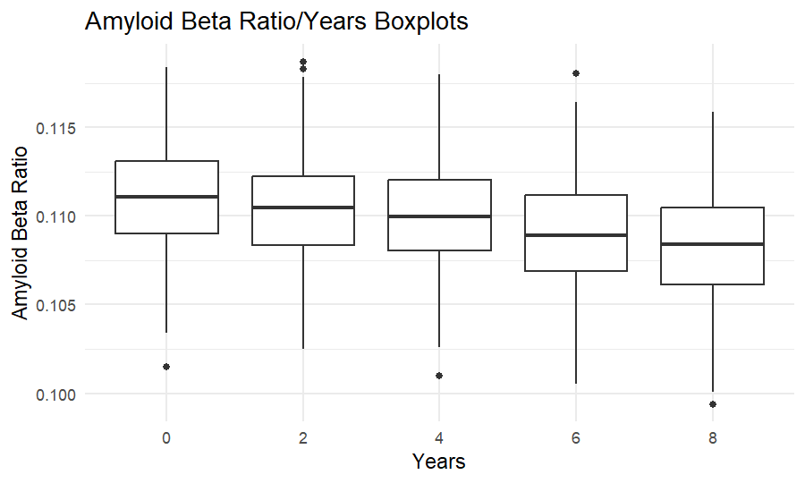

Homework2
================
Zhuodiao Kuang
2023-10-04

``` r
library(tidyverse)
library(dplyr)
library(readxl)
library(knitr)
```

# Problem 1

We clean the 538 `pols` data, which provides information on the number
of national politicians who are democratic or republican at any given
time. There are some values for which `prez_gop` is `2` – these are
months in which Ford became President following Nixon’s resignation. In
the new `president` variable created as part of our data cleaning, we
code these as ``` rep`` (same as values when ```prez_gop`is`1\`).

prez_gop: indicator of whether the president was republican on the
associated date (1 = yes, 0 = no) gov_gop: the number of republican
governors on the associated date sen_gop: the number of republican
senators on the associated date rep_gop: the number of republican
representatives on the associated date prez_dem: indicator of whether
the president was democratic on the associated date (1 = yes, 0 = no)
gov_dem: the number of democratic governors on the associated date
sen_dem: the number of democratic senators on the associated date
rep_dem: the number of democratic representatives on the associated date

# First step

``` r
month_df = 
  tibble(
    month_num = 1:12,
    month_abb = month.abb,
    month = month.name
  )

pm_df = 
  read_csv("./data/pols-month.csv") |>
  separate(mon, into = c("year", "month_num", "day"), convert = TRUE) |>
  mutate(
    president = recode(prez_gop, "0" = "dem", "1" = "rep", "2" = "rep")) |>
  left_join(x = _, y = month_df) |> 
  select(year, month, everything(), -day, -starts_with("prez"))  
```

# Second step

``` r
snp_df = 
  read_csv("./data/snp.csv") |>
  separate(date, into = c("month", "day", "year"), convert = TRUE) |>
  arrange(year, month) |>
  mutate(month = month.name[month],year = ifelse(year>=50, 1900+year, 2000+year)) |> 
  select(year, month, close) 
```

# Third step

Finally, we tidy the `unemployment` data so that it can be merged with
the `pols` and `snp` datasets.

``` r
unemployment = 
  read_csv("./data/unemployment.csv") |>
  rename(year = Year) |>
  pivot_longer(
    Jan:Dec, 
    names_to = "month_abb",
    values_to = "unemployment"
  ) |> 
  left_join(x = _, y = month_df) |> 
  select(year, month, unemployment)
```

# Last step

Now we merge the three datasets!

``` r
data= 
  left_join(pm_df, snp_df) |>
  left_join(x = _, y = unemployment)

str(data)
```

    tibble [822 × 13] (S3: tbl_df/tbl/data.frame)
     $ year        : num [1:822] 1947 1947 1947 1947 1947 ...
     $ month       : chr [1:822] "January" "February" "March" "April" ...
     $ month_num   : int [1:822] 1 2 3 4 5 6 7 8 9 10 ...
     $ gov_gop     : num [1:822] 23 23 23 23 23 23 23 23 23 23 ...
     $ sen_gop     : num [1:822] 51 51 51 51 51 51 51 51 51 51 ...
     $ rep_gop     : num [1:822] 253 253 253 253 253 253 253 253 253 253 ...
     $ gov_dem     : num [1:822] 23 23 23 23 23 23 23 23 23 23 ...
     $ sen_dem     : num [1:822] 45 45 45 45 45 45 45 45 45 45 ...
     $ rep_dem     : num [1:822] 198 198 198 198 198 198 198 198 198 198 ...
     $ president   : chr [1:822] "dem" "dem" "dem" "dem" ...
     $ month_abb   : chr [1:822] "Jan" "Feb" "Mar" "Apr" ...
     $ close       : num [1:822] NA NA NA NA NA NA NA NA NA NA ...
     $ unemployment: num [1:822] NA NA NA NA NA NA NA NA NA NA ...

So the pols_month dataset contains the information of presidents,
governors, senators, and representatives from Republican and Democratic
during different periods.

The snp dataset contains the Standard & Poor’s stock market index during
different periods.

The unemployment dataset contains the unemployment rate in the US during
different periods.

The period of the dataset is from 1947 to 2015. The size of the merged
dataset is 822 x 12.

# Problem 2

### Read and clean the Mr. Trash Wheel sheet

``` r
# load the dataset, change the format of date, recalculate homes_powered
mr_trash_wheel_df = 
  readxl::read_excel("./data/202309TWCD.xlsx", sheet = "Mr. Trash Wheel", range = "A2:M586")|>
  janitor::clean_names()|>
  drop_na(dumpster) |> # omit rows that do not include dumpster-specific data
  mutate(
    date = substr(date, nchar(date) - 1, nchar(date)),
    year = as.character(year), # alter the type of year
    homes_powered = (weight_tons*500/30),
    name = "Mr_trash_wheel")|># add a column to specify
  rename(day = date)|>
  select(dumpster,name,month,year,day,everything())
head(mr_trash_wheel_df)
```

    # A tibble: 6 × 15
      dumpster name           month year  day   weight_tons volume_cubic_yards
         <dbl> <chr>          <chr> <chr> <chr>       <dbl>              <dbl>
    1        1 Mr_trash_wheel May   2014  16           4.31                 18
    2        2 Mr_trash_wheel May   2014  16           2.74                 13
    3        3 Mr_trash_wheel May   2014  16           3.45                 15
    4        4 Mr_trash_wheel May   2014  17           3.1                  15
    5        5 Mr_trash_wheel May   2014  17           4.06                 18
    6        6 Mr_trash_wheel May   2014  20           2.71                 13
    # ℹ 8 more variables: plastic_bottles <dbl>, polystyrene <dbl>,
    #   cigarette_butts <dbl>, glass_bottles <dbl>, plastic_bags <dbl>,
    #   wrappers <dbl>, sports_balls <dbl>, homes_powered <dbl>

### Use a similar process to import, clean, and organize the data for Professor Trash Wheel and Gwynnda.

``` r
prof_trash_wheel_df = 
  readxl::read_excel("./data/202309TWCD.xlsx", sheet = "Professor Trash Wheel", range = "A2:M108")|> 
  janitor::clean_names() |> # use reasonable variable names
  drop_na(dumpster) |> # omit rows that do not include dumpster-specific data
  mutate(homes_powered = weight_tons * 500 / 30,
         date = substr(date, nchar(date) - 1, nchar(date)),
         year = as.character(year), # alter the type of year
         name = "Professory")|>
  rename(day = date)|>
  select(dumpster,name,month,year,day,everything())
head(prof_trash_wheel_df)
```

    # A tibble: 6 × 14
      dumpster name       month    year  day   weight_tons volume_cubic_yards
         <dbl> <chr>      <chr>    <chr> <chr>       <dbl>              <dbl>
    1        1 Professory January  2017  02           1.79                 15
    2        2 Professory January  2017  30           1.58                 15
    3        3 Professory February 2017  26           2.32                 18
    4        4 Professory February 2017  26           3.72                 15
    5        5 Professory February 2017  28           1.45                 15
    6        6 Professory March    2017  30           1.71                 15
    # ℹ 7 more variables: plastic_bottles <dbl>, polystyrene <dbl>,
    #   cigarette_butts <dbl>, glass_bottles <dbl>, plastic_bags <dbl>,
    #   wrappers <dbl>, homes_powered <dbl>

``` r
gwy_trash_wheel_df = 
  readxl::read_excel("./data/202309TWCD.xlsx", sheet = "Gwynnda Trash Wheel", range = "A2:J157")|> 
  janitor::clean_names() |> # use reasonable variable names
  drop_na(dumpster) |> # omit rows that do not include dumpster-specific data
  mutate(homes_powered = weight_tons * 500 / 30,
         date = substr(date, nchar(date) - 1, nchar(date)),
         year = as.character(year), # alter the type of year
         name = "Gwynnda")|>
  rename(day = date)|>
  select(dumpster,name,month,year,day,everything())
head(gwy_trash_wheel_df)
```

    # A tibble: 6 × 12
      dumpster name    month  year  day   weight_tons volume_cubic_yards
         <dbl> <chr>   <chr>  <chr> <chr>       <dbl>              <dbl>
    1        1 Gwynnda July   2021  03           0.93                 15
    2        2 Gwynnda July   2021  07           2.26                 15
    3        3 Gwynnda July   2021  07           1.62                 15
    4        4 Gwynnda July   2021  16           1.76                 15
    5        5 Gwynnda July   2021  30           1.53                 15
    6        6 Gwynnda August 2021  11           2.06                 15
    # ℹ 5 more variables: plastic_bottles <dbl>, polystyrene <dbl>,
    #   cigarette_butts <dbl>, plastic_bags <dbl>, homes_powered <dbl>

### Then, combine the three datasets.

``` r
trash_wheel_df = 
  mr_trash_wheel_df |> 
  full_join(prof_trash_wheel_df) |> 
  full_join(gwy_trash_wheel_df) |> 
  relocate(name) # put the name of the trash wheel front
head(trash_wheel_df )
```

    # A tibble: 6 × 15
      name           dumpster month year  day   weight_tons volume_cubic_yards
      <chr>             <dbl> <chr> <chr> <chr>       <dbl>              <dbl>
    1 Mr_trash_wheel        1 May   2014  16           4.31                 18
    2 Mr_trash_wheel        2 May   2014  16           2.74                 13
    3 Mr_trash_wheel        3 May   2014  16           3.45                 15
    4 Mr_trash_wheel        4 May   2014  17           3.1                  15
    5 Mr_trash_wheel        5 May   2014  17           4.06                 18
    6 Mr_trash_wheel        6 May   2014  20           2.71                 13
    # ℹ 8 more variables: plastic_bottles <dbl>, polystyrene <dbl>,
    #   cigarette_butts <dbl>, glass_bottles <dbl>, plastic_bags <dbl>,
    #   wrappers <dbl>, sports_balls <dbl>, homes_powered <dbl>

The three given data sets are all related to the total weight and volume
of the trash, the number of different waste products, the number of the
dumpster, and the number of households the trash equates to in terms of
electricity on a given date.

Specifically, the cleaned “Mr. Trash Wheel” data set contains 584
observations of 15 variables from May, 2014 to June, 2023. The cleaned
“Professor Trash Wheel” data set contains 106 observations of 14
variables from January, 2017 to June, 2023. the cleaned “Gwynnda Trash
Wheel” data set contains 155 observations of 12 variables from July,
2021 to June, 2023.  
For the resulting datasheet, it contains 845 observations of 15
variables, among which the `name` variable marks the trash wheel’s name
Mr_trash_wheel, Professory, Gwynnda.

It can be concluded that the total weight of trash collected by
Professor Trash Wheel is 216.26 and the total number of cigarette butts
collected by Gwynnda in July of 2021 is 16300.

# Problem 3

``` r
mci_baseline_df = 
  read_csv("./data_mci/MCI_baseline.csv", skip = 1, # skip the first row
           na = c(".", "NA")) |> # treat the missing value as NA
  janitor::clean_names() |> 
  mutate(
    sex = if_else(sex == 0, 'female', 'male'),
    apoe4 = case_match(
      apoe4,
      1 ~ "APOE4 carrier",
      0 ~ "APOE4 non-carrier"
    )
  ) |> 
  # the MCI onset happens after baseline
  filter(current_age < age_at_onset | is.na(age_at_onset) == 1)
```

For the data cleaning, first I skipped the first row which contains
notes for the columns, and treated the missing values as NA for
convenience afterwards. The `case_match` step converts the numerical
values of the `sex` and `apoe4` variables to their original meanings for
readability. In the end, I compared the `current_age` variable and
`age_at_onset` variable to ensure the MCI onset happens after baseline.
After cleaning, the data set contains 479 observations of 6 variables.  
From the data set, it could be concluded that 479 participants in total
were recruited, among which 479 participants met the criteria, and 93
develop MCI. After the participants who do not meet the criteria are
removed, the average baseline age is 65.03, and NaN% of women in the
study are APOE4 carriers.

### Similarly, import, clean, and tidy the dataset of longitudinally observed biomarker values.

``` r
mci_amyloid_df = 
  read_csv("./data_mci/mci_amyloid.csv", skip = 1, # skip the first row
           na = c("NA", "Na")) |>
  janitor::clean_names() |> 
  pivot_longer(
    baseline:time_8,
    names_to = "time_in_years",
    names_prefix = "time_",
    values_to = "ABR"
  ) |> 
  mutate( # change baseline to 0 year
    time_in_years = replace(time_in_years, time_in_years == "baseline", 0),
    ABR = as.numeric(ABR)
  )
```

For the data cleaning, first, I skipped the first row, which contains
notes for the columns, and treated “Na” and “NA” both as NA values
because there is a “Na” value inside the “Baseline” variable. Then, I
converted the five variables measuring the ratio at a given time into
two variables named “time_in_years” and “ABR”. After cleaning, the data
set contains 2435 observations of 3 variables. The ratio distribution
for different years is illustrated below:

``` r
mci_amyloid_df |> 
  ggplot(aes(y = ABR, x = time_in_years)) + 
  geom_boxplot()+
  labs(
    title = "Amyloid Beta Ratio/Years Boxplots",
   x = "Years",
    y = "Amyloid Beta Ratio")+
   viridis::scale_color_viridis(
    name = "Years", 
    discrete = TRUE
  )
```



From the boxplot, it could be concluded that as the number of years
increases, the ratio tends to drop in overall.

### Compare the two datasets.

Check whether some participants appear in only the baseline or amyloid
datasets.

``` r
all_participants_df =
  mci_baseline_df |> 
  full_join(mci_amyloid_df, by = join_by(id == study_id),
            keep = T) # keep both id and study_id for comparision
```

Then, 80 participants are only in the amyloid datset, 8 participants are
only in the baseline datset.  
Retain only the participants who appear in both datasets.

``` r
both_participants_df = 
  mci_baseline_df |> 
  inner_join(mci_amyloid_df, by = join_by(id == study_id))
write_csv(both_participants_df, "./data_mci/mci_result.csv") # export
```

The result contains 2355 observations of 8 variables related to the
participants’ baseline demographics and amyloid $\beta$ 42/40 ratio
measured every two years from the baseline to the eighth year. Among the
471 participants, 0 are female, 142 are APOE4 carriers. The average
current age at baseline is 65.05 (years old), and the average length of
education at baseline is 16.38 years.
